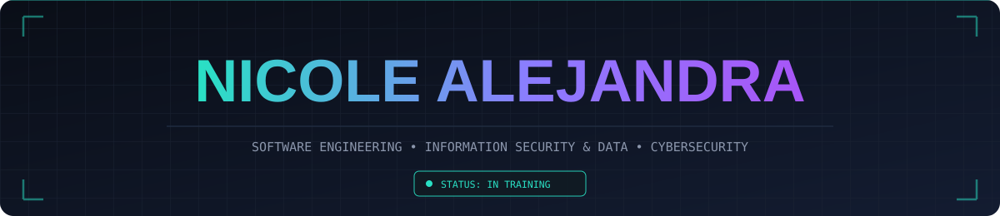

<p align="center"></p>

<div align="center">
  
<br/>

<a href="https://github.com/alejandra-apaza-tech">
  
</a>

<br/>

```ini
[ SYSTEM BOOT SEQUENCE INITIATED ]
> Carregando módulo: IDENTIDADE ............ OK
> Carregando módulo: CIBERSEGURANÇA ........ OK
> Carregando módulo: DADOS & BANCO ......... OK
> Carregando módulo: FRONT-END ............. OK
> Verificando integridade do sistema ....... 100%
> STATUS: IN TRAINING
> Acesso concedido. Bem-vinda, visitante.
```

</div>

<br/>

## 👋 Pequena apresentação

Olá! Sou **Nicole Alejandra**, estudante de Engenharia de Software com foco em **Cibersegurança e Defesa de Dados**. Tenho interesse em desenvolvimento de software, segurança da informação, banco de dados e experiências digitais centradas no usuário. Estou em constante evolução, transformando desafios em aprendizado e buscando criar soluções seguras, eficientes e inovadoras. Atualmente, aprofundo meus conhecimentos em Python, Java, SQL, desenvolvimento web e proteção de sistemas, construindo uma base sólida para atuar no universo da tecnologia.

**Frase de destaque:**

> 🔐 *"Proteger dados hoje é construir confiança para o futuro."*

<br/>

## 🧠 Sobre Mim

<table align="center">
<tr>
<td>

```yaml
sistema:
  usuario: Nicole Alejandra
  funcao_atual: Estudante de Engenharia de Software
  foco_principal: Cibersegurança & Defesa de Dados
  estudando_agora:
    - Desenvolvimento Front-end Web
    - Banco de Dados
    - Prototipagem (Figma/UX)
    - Cibersegurança
  disciplinas_concluidas:
    - Python
    - Banco de Dados
    - Algoritmos
    - Prototipagem de Sistemas
  idiomas: [Espanhol, Português (BR), Inglês (intermediário)]
  modo: Dark Mode :: Always
```

</td>
</tr>
</table>

<br/>

## 🚀 Projeto em Destaque

<div align="center">

| Projeto | Descrição | Tecnologias | Link |
| :-- | :-- | :-- | :-- |
| 🐾 **Clínica Mundo Pet** | Site para clínica veterinária, com páginas de serviços e contato | HTML · CSS · JS | [Ver repositório](https://github.com/alejandra-apaza-tech/clinica-mundo-pet) |

</div>

<br/>

## ⚙️ Tech Stack

<div align="center">

**Linguagens que utilizo**
<br/>


<br/><br/>

**Frontend**
<br/>


<br/><br/>

**Backend**
<br/>


<br/><br/>

**Banco de Dados**
<br/>


<br/><br/>

**DevOps & Cloud**
<br/>


</div>

<br/>

## 🛠️ Ferramentas que utilizo

<div align="center">

<br/>


</div>

<br/>

## 🌱 Em desenvolvimento

<div align="center">

<br/>
<sub>C# · PHP · e outras que virão...</sub>
</div>

<br/>

## 🐍 Snake Contribution

<div align="center">

</div>

<br/>

## 🌐 Onde me encontrar

<div align="center">

<a href="https://www.linkedin.com/in/nicole-alejandra-8948ab3b4"></a>
<a href="https://mail.google.com/mail/?view=cm&to=alejandraapaza3020@gmail.com"></a>
<a href="https://wa.me/5511960539146?text=Olá%20Alejandra!%20Vi%20seu%20perfil%20e%20gostaria%20de%20entrar%20em%20contato."></a>
<a href="https://www.instagram.com/alejandrabel.lexie/"></a>
<a href="https://dev.to/alejandra_dev"></a>
<a href="https://twitter.com/alejandradevbel"></a>


<br/><br/>

```ini
[ SYSTEM SHUTDOWN ]
> Encerrando sessão...
> Obrigada pela visita. Até a próxima conexão.
```


</div>
